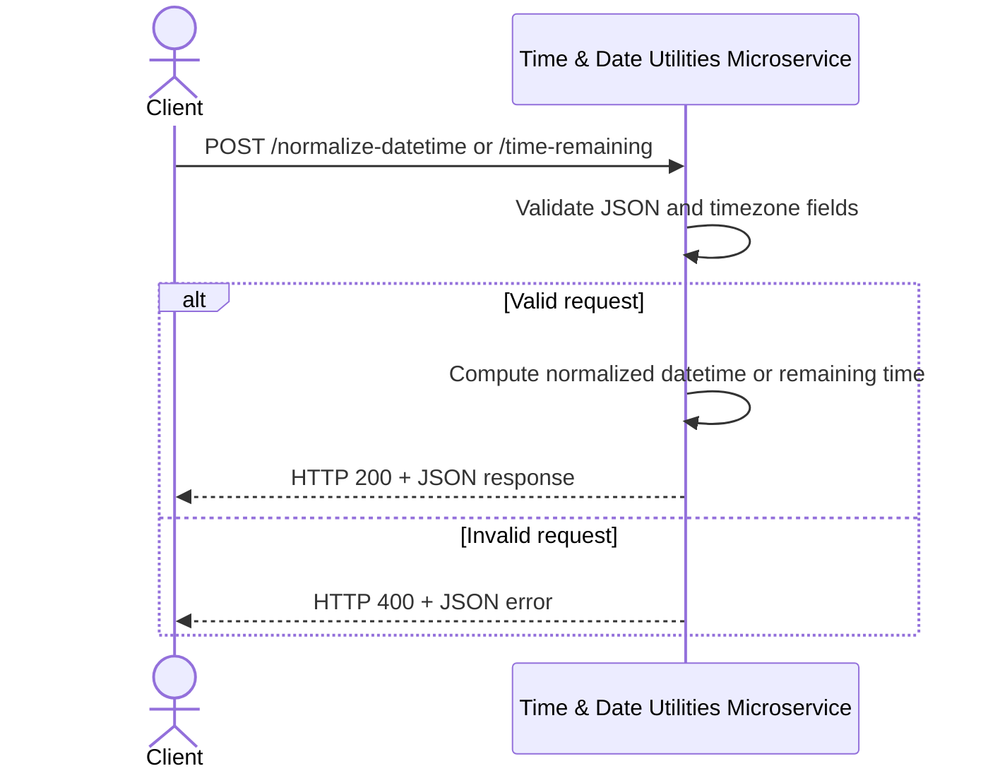

# Time & Date Utilities Microservice

## A) What this microservice does
This microservice provides standardized time-related operations for client programs. It currently supports:
- normalizing a datetime into ISO 8601 format in a target timezone
- calculating the time remaining until a target datetime

It is headless and is meant to be called programmatically.

## How to run locally
```bash
python -m pip install -r requirements.txt
python app.py
```
In another terminal:
```bash
python test_client.py
```

## B) How to REQUEST data
### Endpoint 1
- Method: `POST`
- Path: `/normalize-datetime`
- Content-Type: `application/json`

Required JSON fields:
- `dateTime` (string)
- `sourceTimezone` (string)
- `targetTimezone` (string, optional, defaults to `UTC`)

### Endpoint 2
- Method: `POST`
- Path: `/time-remaining`
- Content-Type: `application/json`

Required JSON fields:
- `targetDateTime` (string)
- `timezone` (string)

### Example request
```python
import requests
payload = {
  "dateTime": "2026-03-15 14:30:00",
  "sourceTimezone": "America/Los_Angeles",
  "targetTimezone": "UTC"
}
resp = requests.post("http://127.0.0.1:5002/normalize-datetime", json=payload, timeout=2)
print(resp.status_code, resp.json())
```

## C) How to RECEIVE data
Response type: JSON

### Example success response
```json
{
  "originalInput": "2026-03-15 14:30:00",
  "sourceTimezone": "America/Los_Angeles",
  "targetTimezone": "UTC",
  "iso8601": "2026-03-15T21:30:00+00:00",
  "unixTimestamp": 1773610200
}
```

### Example error response
```json
{
  "errorCode": "INVALID_REQUEST",
  "message": "Invalid sourceTimezone.",
  "details": {"sourceTimezone": "Invalid/Zone"}
}
```

## D) UML Sequence Diagram

